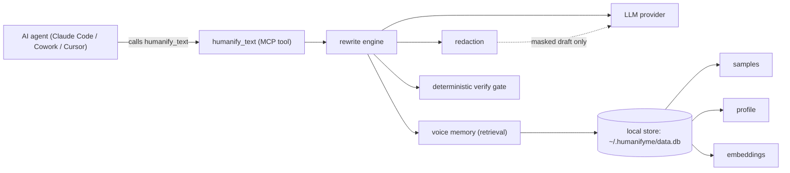
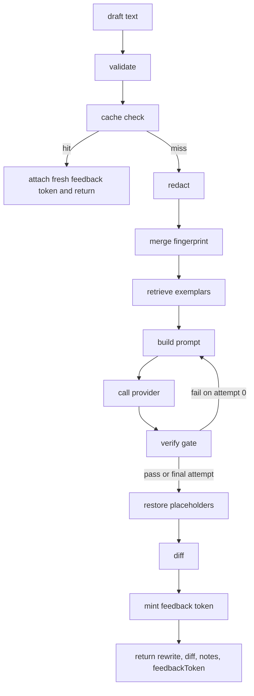
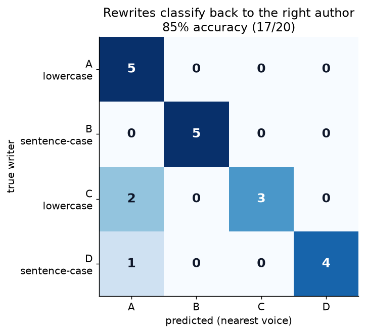
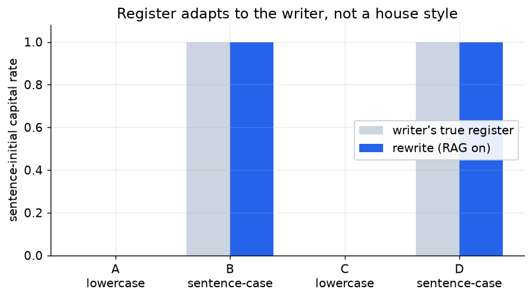
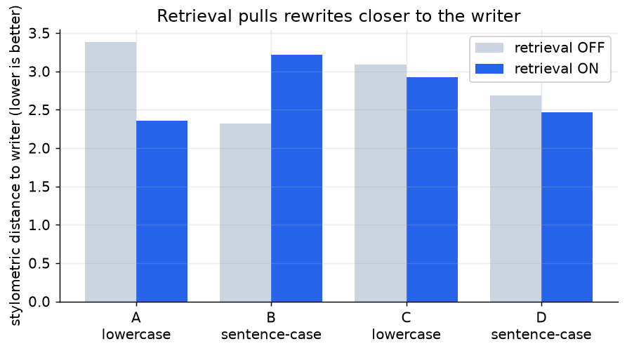
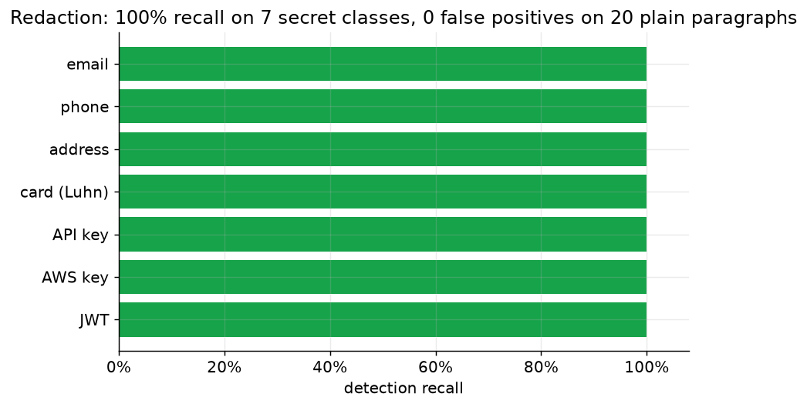

# HumanifyMe

**Make AI sound like you.**

[](https://github.com/JoshMcQ/HumanifyMe/actions/workflows/ci.yml)
[](LICENSE)
[](https://nodejs.org)
[](https://claude.com/claude-code)

HumanifyMe learns how one specific person writes and rewrites an AI agent's output in that person's voice before a human reads it. You install it as a plugin in Claude Code, Cowork, Cursor, and other AI agents. It is not "write better." It is "stop sounding like AI."

## The problem, and the evidence behind it

People hand more of their writing to AI agents every day: commit messages, PR descriptions, Slack posts, email drafts. Every agent produces the same recognizable register, polished, balanced, faintly corporate, and recipients have learned to spot it. The usual fixes (Grammarly, Wordtune, "AI humanizers") push text toward a generic professional voice, which is the opposite of the goal.

The starting assumption is checkable, and a large study tested it. Wang et al. (2025) ran tens of thousands of generations across frontier models and hundreds of real authors and found that few-shot prompting does not convincingly imitate ordinary writers in informal genres: authorship-verification accuracy on blog-style text stays low, structured genres like news and email do far better, and more exemplars give diminishing returns [13]. The plain reading is that dropping a few samples into a prompt and asking a model to "write like me" hits a ceiling on casual voice. HumanifyMe's response to that ceiling is a persistent, retrievable corpus of the user's own writing plus a paraphrase-then-restyle rewrite, rather than a longer prompt.

Two words get used here and they are not the same thing. MCP (Model Context Protocol) is the protocol HumanifyMe speaks: the standard an agent uses to call a tool like `humanify_text`. A plugin is how you install it: a small bundle that registers that MCP server plus a few skills in your agent in one step. So the plugin is the package you add, and MCP is what the server inside it talks. You install the plugin once and never deal with either word again.

## System architecture

An agent calls one tool, `humanify_text`. Everything else happens locally, and the only data that crosses the network is a redacted draft sent to the configured LLM provider.



## Install

### As a plugin (start here)

HumanifyMe is published as the `humanifyme` package on npm and bundled as a plugin in [`humanifyme.plugin/`](humanifyme.plugin/): a `plugin.json` manifest, the MCP server it registers (run via `npx -y humanifyme`), and three skills that teach the agent when to reach for it (`humanify`, `build-voice-profile`, `humanify-pr`). In Claude Code or Cowork, add it through the plugin or marketplace flow; the bundle handles MCP registration for you. Copy-paste setup for every other agent (Cursor, Continue, Cline, Windsurf, Zed, ChatGPT desktop) is in [`docs/install/`](docs/install/).

Once installed:

1. Give it 3 to 10 of your real writing samples through the `build-voice-profile` skill.
2. HumanifyMe builds a structured voice fingerprint and stores it locally.
3. Your agent calls `humanify_text` automatically through bundled skills, or explicitly when you ask.

### Command line

```bash
npm install        # Node >= 22.5 (uses the built-in node:sqlite)
npm run build      # tsup -> dist/humanifyme-mcp.mjs (MCP) + dist/humanifyme.mjs (CLI)

node dist/humanifyme.mjs setup                                   # consent
node dist/humanifyme.mjs provider set anthropic --api-key sk-... # your key
node dist/humanifyme.mjs sample add my-email.txt --label email   # 3+ samples
node dist/humanifyme.mjs profile rebuild
echo "We are delighted to leverage synergies." | node dist/humanifyme.mjs rewrite
```

### Raw MCP registration

If your agent does not use the plugin format, register the server directly:

```bash
claude mcp add humanifyme -- node /path/to/repo/dist/humanifyme-mcp.mjs
```

The server exposes 16 `humanify_*` tools in one registry: the headline `humanify_text`, plus feedback and metrics, sample add/list/delete, profile get/build/update/delete, provider set, key test, audit list, wipe-all, and two importers (chat export and text files). The same engine runs without MCP via the `humanifyme` CLI (`rewrite`, `metrics`, `share on|off`, `setup`).

## The rewrite pipeline

The whole rewrite lives in one function, `rewrite(args)` in `src/engine/rewrite.ts`, shared by the MCP tool layer and the CLI. The shape is paraphrase-then-restyle, the recipe most authorship style transfer still uses: strip the source style, then re-render toward the learned target voice [11]. That second step is the hard one. Few-shot style transfer moves text away from a source style more reliably than it moves text toward a target style [12], which is exactly why the engine does not rely on exemplars alone and follows every generation with the deterministic gate below.



A few stages carry the weight:

**Cache before redaction.** The cache key is a sha256 over the profile hash, context label, sorted directives, draft hash, and a retrieval signature. A hit returns immediately, so redaction is not always the first thing that happens to a draft. The retrieval signature folds in the embedder model, sample count, newest-sample timestamp, and every `rag.*` tunable, so adding or removing a voice sample invalidates the cache without running retrieval on the hit path.

**Redact, then restore.** `redact(draft)` masks PII into numbered placeholders before anything crosses the network. After the model responds, `restore()` puts the originals back, so you never see a `[EMAIL_1]` token. A draft that is nothing but redactable content throws `EMPTY_AFTER_REDACTION` instead of being sent.

### The quality moat: deterministic verification

Most "rewrite in my voice" tools stop at the prompt and hope the model behaved. The published field converges on ensemble evaluation, which is an offline, aggregate measurement across many outputs. That is the right tool for judging a system, but it is the wrong tool for a single rewrite: an aggregate score can report strong average voice match while individual outputs quietly drop a price, alter a version number, or reintroduce a banned phrase. HumanifyMe adds a per-rewrite gate instead, closer to a contract test than to a benchmark. We hold this as design rationale, not as a result from the literature.

After every generation, `verifyRewrite()` in `src/engine/verify.ts` runs a pure, deterministic gate over the candidate, all against the redacted draft so raw PII never reaches this layer. It runs exactly five mechanical checks:

1. **Banned words.** Flags a word only if the model introduced it (present in the rewrite, absent from your draft). A banned word you wrote yourself is left alone.
2. **Numbers.** Every digit-bearing token in the draft (dates, prices, versions, percentages) must survive verbatim, or `missing_number` fires.
3. **URLs.** Every `http(s)` URL must survive byte for byte.
4. **Redaction placeholders.** Every `[THING_N]` must survive so `restore()` can put the real value back. A dropped numeric suffix still passes; only a fully vanished placeholder fails.
5. **Casing register.** Learned per user, not a house style. The fingerprint records whether you write all-lowercase or sentence-case, and the gate enforces it. The threshold is forgiving on purpose: a single proper noun for a lowercase writer is tolerated, not punished.

On attempt 0, any issues (or an out-of-band length ratio) become natural-language instructions threaded into the next system prompt, and the loop retries exactly once. On the final attempt, surviving issues become user-facing "review before sending" notes. Verification never blocks output. The only thing that always forces another attempt is empty model output.

### The voice fingerprint

HumanifyMe learns your voice as a single structured JSON object, a `VoiceFingerprint` plus per-context overrides, not as an opaque vector. This is a deliberate descendant of the cheap, interpretable feature tradition in computational stylometry, where function-word frequencies, character n-grams, and similar surface features carry strong per-author signal without a neural model [1][2][3]. An interpretable, labeled-axis representation is something a person can read and correct, in the spirit of style embeddings whose axes are named linguistic attributes rather than dimensions of a black box [4]. An opaque embedding cannot be inspected or edited by the person it describes, so it is not used as the user-facing artifact.

`buildProfile.ts` redacts every sample, concatenates them with labels, calls the provider once (`temperature 0.2`, JSON mode), validates against `StyleProfileSchema` with zod, and persists it. No code measures sentence length or contraction rate. The dimensions are LLM judgments mapped to coarse enums. We do not compute Flesch-Kincaid.

The dimensions, in short:

| Dimension | Shape | Enforcement |
| --- | --- | --- |
| `sentenceLength` | average (short/medium/long) + variance | prompt target |
| `formality` | 1 to 5 | prompt target |
| `directness` | 1 to 5 | prompt target |
| `humor`, `profanity`, `contractions` | coarse enums | prompt target |
| `punctuationHabits` | emDash, semicolon, ellipsis, exclamation, parentheses | prompt target |
| `capitalization` | sentenceCase, titleCase, allLowercase | prompt target plus deterministic verify |
| `commonPhrases` | real recurring phrases | used where they fit, never forced |
| `wordsToAvoid` | words you do not use | forbidden plus deterministic verify |
| `greetings` / `signoffs` | your real openers and closers | carried in fingerprint |
| `howTheyAskQuestions` / `howTheyDisagree` / `howTheyApologize` / `howTheyGiveInstructions` | short freeform descriptions | carried as authoritative |
| `exemplars` | 3 to 10 verbatim post-redaction snippets | ground the voice |

Every base dimension can be context-specialized across nine labels (`casual`, `professional`, `annoyed`, `polite`, `direct`, `sales`, `email`, `text`, `linkedin`). At rewrite time the engine deep-merges base with the requested context. The profile is not a single voice on purpose: cross-discourse authorship verification work shows the same person verifiably writes differently across registers, so a single-vector model of their voice would average those away [5]. Most of these dimensions are steered through the prompt; only `wordsToAvoid` and the capitalization register are checked and enforced after generation.

## Your voice memory (the brain)

The retrieved exemplars are the primary voice signal at rewrite time; the structured fingerprint is the structural spec and the cold-start fallback. The reason for that ordering is the strongest head-to-head evidence in the personalization literature: in a controlled comparison across the LaMP tasks, retrieval over a user's own history carried most of the personalization gain while parameter-efficient fine-tuning added little on its own [6]. The multi-stage retrieve-then-condition shape itself is the field standard [7]. Keying retrieval on the user's own writing also keeps raw samples local and out of model weights, which fits the privacy model.

When retrieval is on, HumanifyMe stores embeddings of your own past writing and pulls your most-similar past messages as few-shot exemplars. Here is the part people get wrong: it does not create a database inside your project folder.

The embeddings and your profile live in `~/.humanifyme/data.db`, in your HOME directory, resolved by `src/paths.ts` and overridable only via `HUMANIFYME_HOME`. That means one persistent personal voice memory, shared across every agent and every project on your machine. Open a new repo, switch from Claude Code to Cursor, start a fresh chat: same voice. The memory grows as you add samples, and it never lands in version control by accident because it was never in the project to begin with.

How retrieval works:

- It embeds the already-redacted draft on-device and runs cosine similarity against locally-stored per-sample vectors in the SQLite `sample_embeddings` table.
- Selection is greedy Maximal Marginal Relevance with a recency tiebreaker and a dedup gate (drops candidates whose cosine to an already-chosen exemplar exceeds 0.97). Returning fewer exemplars, or none, is a normal outcome.
- Below `minSamples` (default 5) embedded samples, retrieval returns nothing and the engine stays profile-only.
- The default embedder is dependency-free and offline: `lexical-v1`, a deterministic 512-dim lexical embedder. MiniLM (transformers.js / ONNX, `all-MiniLM-L6-v2`) and Ollama are opt-in, local-only upgrades behind the same interface.
- Sample text is embedded from raw text at ingest, but every selected exemplar is passed through `redact()` again at send time. Store-time redaction is never trusted.
- The whole stage is fail-open: any error degrades to profile-only. Retrieval never blocks a rewrite.

One honest limitation: the MVP keys retrieval on a general-purpose embedder, not a dedicated style embedding. Author embeddings are known to entangle topic with style, so a general embedding will partly retrieve on what a sample is about rather than purely on how it is written [9][10]. Keying retrieval on a content-independent style embedding is the intended direction and a consistent, if modest, win in the retrieval literature [8], with a style-pure embedding as the planned upgrade. We do not claim the MVP already does style-pure retrieval, because the evidence says general embeddings do not.

## Does it actually work?

We ran a four-register evaluation: four writers with distinct voices (casual lowercase, formal sentence-case, terse technical, warm enthusiastic), five generic-AI drafts each, rewritten with retrieval on and off. That is 20 rewrite pairs. The full method, raw numbers, and reproduction steps are in [`docs/proof/README.md`](docs/proof/README.md). Run date 2026-06-24. No single number settles personalized writing, so we report several deterministic measures and where they disagree [16][17].

### Rewrites land on the right author



This is the load-bearing result, and it is not about casing. Take each retrieval-grounded rewrite and ask which of the four writers' real voices it is stylometrically closest to, across word choice, sentence rhythm, punctuation, and function-word habits. A rewrite that caught the voice lands closest to its own writer. 17 of 20 (85 percent) do. The three misses are writer C's terse-lowercase rewrites landing on writer A's casual-lowercase voice twice, and one of writer D's landing on A; A and C share a lowercase casual register, so overlap there is expected. The attribution uses classic interpretable stylometric features as a fast screen, not as a verdict [1][3].

### It also holds the writer's register



A smaller, fully deterministic check: does a rewrite keep the writer's capitalization habit? The two lowercase writers stay at 0.00, the two sentence-case writers at 1.00, enforced by the verify gate plus the learned register rather than by retrieval. Casing is the easiest dimension to see and to verify, which is why it earns a figure, but it is the floor of a voice, not its substance. The attribution result above is the one that speaks to substance.

### Retrieval pulls the rewrite closer



Retrieval pulls the rewrite closer to the real writer for three of the four writers this run. Lower is closer.

| Writer | Distance ON | Distance OFF | Retrieval helps? |
| --- | --- | --- | --- |
| A (casual / lowercase) | 2.35 | 3.38 | yes, clearly |
| B (formal / sentence-case) | 3.22 | 2.32 | no, worse this run |
| C (terse / technical) | 2.92 | 3.09 | yes, small |
| D (warm / enthusiastic) | 2.47 | 2.69 | yes, small |

We report writer B even though retrieval hurt the distance score there this run. The metric is noisy, and we are not rounding a loss into a win.

### Privacy: the guarantee is architectural

The privacy assurance is not a recall percentage. It is that the engine runs on your machine and the privacy-critical code is MIT, so you can read exactly what leaves (see Privacy methodology below). Redaction is a best-effort layer in front of the single network call, not a promise to catch every secret. On the golden fixture set in `src/privacy/redact.test.ts` it masks all seven planted secret classes (emails, phones, addresses, cards, API keys, AWS keys, JWTs) with no false positives on 20 plain paragraphs, deterministically, but it is best-effort by design and documented as such.



### What we do not claim

- We do not count an LLM judging another LLM's output as proof. We ran that check (a model picking which rewrite sounds more like the writer) and it favored the retrieval-grounded one every time, but a model rating a model is a weak proxy. Human evaluation is the honest test, and it is the one we trust.
- We do not claim retrieval helps every writer; it hurt writer B's distance this run.
- We do not claim the engine already does style-pure retrieval. It does not, for the reason given above.
- We do not treat redaction recall as a privacy guarantee. The guarantee is architectural.

The claim is narrow: across four registers, retrieval-grounded rewrites are stylometrically attributable to the correct author 85 percent of the time and move closer to the real voice for most writers. That is it.

## What HumanifyMe will not do: detection bypass

HumanifyMe is not an AI-detection-bypass tool, and the specs say so. The research supports that stance on the merits, not only on ethics. Detection is fragile: there is a theoretical bound on detector reliability, and recursive paraphrasing defeats most detectors in practice [14]. Optimizing to beat a detector is optimizing against a moving, leaky target, and a tool that wins at fooling classifiers proves nothing about whether the output actually sounds like the user.

We do track AI-tell density as a sanity floor, not a target. Generic model prose carries a recognizable stylistic signature, which is the same uniformity the product exists to remove [15]. Lowering AI-tells is necessary but nowhere near sufficient for sounding like a specific person, and it can be satisfied by generic edits that move text toward no one's voice. The voice-fidelity measures, with a human in the loop, remain the thing that matters.

## The research it is based on

The design choices here are grounded in prior work rather than guesses. The prior-art survey, the state-of-the-art review, and the evaluation design live in the repo: [`docs/research/prior-work.md`](docs/research/prior-work.md), [`docs/research/state-of-the-art.md`](docs/research/state-of-the-art.md), and [`docs/research/evaluation.md`](docs/research/evaluation.md). Each maps a line of research to a concrete design choice and is explicit about where the science stops and our opinion starts. The deterministic verify gate and the negative-profile field, in particular, are design bets against named open failure modes, not validated published results.

## Why I built it

I wanted AI to write messages for me and it never quite could. I would have something typed up, ask it to just tighten the wording, and get back a completely different message in a voice that was not mine. So I started prompting my way around it, and that turned into this.

Most of the code was written with Claude Code, Anthropic's agentic coding tool, against specs and acceptance criteria I wrote and reviewed. The product and architecture calls are mine: plugin-first distribution, keeping everything local, the verify gate, and how it gets evaluated.

## Privacy methodology

HumanifyMe is local-first and redacts before it sends. The modules that substantiate the privacy claims (`src/privacy/`, `src/network/`, `src/engine/verify.ts`) are MIT-licensed so you can audit them.

- **Local-first.** All state lives under `~/.humanifyme/` (`config.json` plus `data.db`), overridable only via `HUMANIFYME_HOME`. Raw samples never leave that directory.
- **Redact before send.** `redact()` masks emails, phones, US street addresses, Luhn-checked cards, API keys, AWS access-key IDs, and JWTs into numbered placeholders. Pattern order is load-bearing. Identical values collapse to one placeholder. `restore()` swaps the originals back after the model responds.
- **Re-redact exemplars at send time.** Retrieved voice-memory exemplars are redacted again before sending, never trusting how they were stored.
- **Outbound allowlist plus static scan test.** `src/network/outbound-scan.test.ts` scans the whole `src/` tree to assert that only `src/providers` and `src/network` may call `fetch()`, and that every hardcoded outbound host is on a 4-entry allowlist: `api.anthropic.com`, `api.openai.com`, `generativelanguage.googleapis.com`, `humanifyme.com`.
- **Metadata-only audit log.** Every outbound provider call writes a row with provider, route, payload byte size, draft length, and success, never content. A 20-entry ring buffer surfaced via `humanify_audit_list`.
- **Opt-in, counts-only feedback.** Every rewrite mints a per-rewrite feedback token and writes a pending counts-only row (context, provider, latency, never the text). You answer "did this sound like you?" and `humanify_metrics` aggregates the answers locally. Anonymous sharing of those aggregate counts is OFF by default, gated to once per 24h, and lives in one MIT-licensed module, `src/network/feedbackShip.ts`, which ships only a salted install id plus counts.

## Repository layout

```
/README.md                       <- you are here
/src/                            <- the MCP server + CLI (TypeScript)
/humanifyme.plugin/              <- plugin bundle: manifest, MCP registration, skills
/prompts/                        <- LLM prompt templates for the rewrite engine
/evals/                          <- ablation runner, scorers, results
/docs/                           <- research, proof, install snippets, data model, contracts
```

## Contributing

We want maintainers. Read [`CONTRIBUTING.md`](CONTRIBUTING.md) for branch, test, and PR conventions, then read `src/engine/rewrite.ts`, `src/engine/verify.ts`, and `src/privacy/`. That trio is the heart of the methodology above, and it is MIT-licensed. The one set of rules you cannot break is `specs/privacy-security-spec.md`. When you change behavior, `src/network/outbound-scan.test.ts` and `src/engine/verify.test.ts` must stay green. Good first issues are labeled `good first issue` on the tracker.

## License

Source-available. Most of the repo is proprietary. The parts that substantiate the privacy claims (`src/privacy/`, `src/network/`, and `src/engine/verify.ts`) are MIT, see `LICENSE`, `LICENSE-MIT.txt`, and the `SPDX-License-Identifier: MIT` headers.

## References

These are the works HumanifyMe's design rests on, drawn from the project's prior-work survey ([`docs/research/prior-work.md`](docs/research/prior-work.md)). Titles, authors, and years are reproduced as given there and should be web-verified before external use.

1. Stamatatos. A Survey of Modern Authorship Attribution Methods. JASIST, 2009.
2. Koppel, Schler & Argamon. Computational Methods in Authorship Attribution. JASIST, 2009.
3. Abbasi & Chen. Writeprints. ACM TOIS, 2008.
4. Patel et al. LISA: Learning Interpretable Style Embeddings. Findings of EMNLP, 2023.
5. Stamatatos, Bevendorff et al. PAN 2023 Cross-Discourse Authorship Verification Overview. CLEF / Springer LNCS, 2023.
6. Salemi & Zamani. RAG vs PEFT for Privacy-Preserving Personalization. ACM TOIS, 2025.
7. Li et al. Teach LLMs to Personalize, 2023.
8. Neelakanteswara et al. RAGs to Style. Personalize at ACL, 2024.
9. Wegmann, Schraagen & Nguyen. Same Author or Just Same Topic? RepL4NLP at ACL, 2022.
10. Wang et al. Can Authorship Representation Learning Capture Stylistic Features? TACL, 2023.
11. Krishna, Wieting & Iyyer. STRAP. EMNLP, 2020.
12. Patel, Andrews & Callison-Burch. STYLL, 2022.
13. Wang et al. Catch Me If You Can? Not Yet. Findings of EMNLP, 2025.
14. Sadasivan et al. Can AI-Generated Text Be Reliably Detected? ICML, 2024.
15. Rivera-Soto et al. Few-Shot Detection of Machine-Generated Text Using Style Representations. ICLR, 2024.
16. Jangra et al. Evaluating Style-Personalized Text Generation, 2025.
17. Jin et al. A Survey of Deep Learning for Text Style Transfer. Computational Linguistics (MIT Press), 2022.
