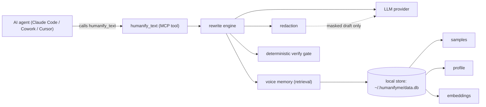

# HumanifyMe

**Make AI sound like you.** · [humanifyme.com](https://humanifyme.com)

[](https://www.npmjs.com/package/humanifyme)
[](https://humanifyme.com)
[](https://github.com/JoshMcQ/HumanifyMe/actions/workflows/ci.yml)
[](LICENSE)
[](https://nodejs.org)
[](https://claude.com/claude-code)

HumanifyMe learns how *one specific person* writes, then rewrites an AI agent's output in that person's voice before anyone reads it. Install it once and every agent on your machine — Claude Code, Cowork, Cursor — rewrites in the same voice. It is not "write better." It is "stop sounding like AI."

It runs locally. The only thing that crosses the network is a redacted draft sent to the LLM provider you choose.

## Quickstart

Run the secure one-time setup first. It explains the privacy boundary, hides your
provider key while you type it, validates the provider, collects three writing
samples, builds your profile, and offers a first rewrite:

```bash
npx -y humanifyme@0.2.0 setup
```

Never paste a provider key into an AI chat or pass it as a command-line flag. Then
install the plugin from the bundled marketplace — no clone or build:

```bash
claude plugin marketplace add JoshMcQ/HumanifyMe   # register the marketplace
claude plugin install humanifyme@humanifyme        # installs 3 skills + the MCP server
```

Then use **`/humanifyme:humanify`** on any draft, or let the bundled skills trigger
it after an agent drafts an email, PR, or message. The CLI and every installed
agent share the profile stored in `~/.humanifyme/`. Use
**`/humanifyme:build-voice-profile`** later to add samples or rebuild it.

Run `/reload-plugins` if you installed mid-session. Using a different agent (Cursor, Continue, Cline, Windsurf, Zed, ChatGPT desktop) or the CLI? See [Install](#install).

Want to inspect a draft before setting up a profile? The analyzer is local, deterministic, and needs no API key:

```bash
echo "At its core, this robust approach paves the way." | npx -y humanifyme analyze
```

It reports the exact phrases and punctuation it matched against the public [90-sign AI-writing checklist](docs/ai-writing-signs.md). It is an editing aid, not an AI detector; subjective signs stay labeled for human review instead of being turned into a fake probability.

## Why it exists

People hand more of their writing to AI every day — commits, PR descriptions, Slack posts, email drafts — and every agent produces the same recognizable register: polished, balanced, faintly corporate. Recipients have learned to spot it. The usual fixes (Grammarly, Wordtune, "AI humanizers") push text toward a *generic* professional voice, which is the opposite of the goal.

Few-shot prompting alone cannot close the gap. A large 2025 study ran tens of thousands of generations across frontier models and hundreds of real authors and found that dropping a few samples into a prompt and asking a model to "write like me" hits a ceiling on casual voice ([Wang et al., 2025](https://arxiv.org/abs/2509.14543)). HumanifyMe's answer to that ceiling is a persistent, retrievable corpus of *your* writing plus a paraphrase-then-restyle rewrite — not a longer prompt.

> **MCP vs. plugin.** MCP (Model Context Protocol) is the protocol HumanifyMe speaks, so any MCP-compatible agent can call its `humanify_text` tool. A plugin is the packaging format (used by Claude Code and Cowork) that bundles the MCP server plus skills into one installable unit. You can install the plugin, or [register the MCP server directly](#raw-mcp-registration).

## How it works

An agent calls one tool, `humanify_text`. Everything else happens on your machine.



The rewrite is **paraphrase-then-restyle**: strip the source style, re-render toward your learned voice, then run a deterministic gate no prompt can skip. The three pieces that carry the design:

- **Deterministic verification — the quality moat.** Most "rewrite in my voice" tools stop at the prompt and hope. After every generation, [`src/engine/verify.ts`](src/engine/verify.ts) runs five mechanical checks against the redacted draft: words the model *introduced* from your avoid-list, dropped numbers (dates, prices, versions), broken URLs, vanished redaction placeholders, and your learned casing register. Failures on the first attempt become instructions for one retry; survivors become user-facing "review before sending" notes. It never blocks output.
- **An editable voice fingerprint.** Your voice is a readable, labeled JSON object — sentence length, formality, directness, punctuation habits, words you avoid, your real greetings and sign-offs — not an opaque vector. Every dimension can be specialized per context (casual, professional, email, annoyed, …) and deep-merged at rewrite time. You can read it and correct it.
- **Retrieval over your own writing.** Embeddings of your past messages live locally and are pulled as few-shot exemplars at rewrite time, with the structured fingerprint as the structural spec and cold-start fallback. One persistent voice memory in `~/.humanifyme/data.db`, shared across every agent and project on your machine. The default embedder is offline and dependency-free; MiniLM and Ollama are opt-in, local-only upgrades.

Deep dives: [architecture & rewrite pipeline](docs/architecture.md) · [voice memory & retrieval](docs/voice-memory.md) · [data model](docs/data-model.md).

## Install

### As a plugin (start here)

HumanifyMe is bundled as a plugin in [`humanifyme.plugin/`](humanifyme.plugin/): a `.claude-plugin/plugin.json` manifest, an `.mcp.json` that registers the MCP server, and three skills (`humanify`, `build-voice-profile`, `humanify-pr`). The repo root ships a marketplace catalog at [`.claude-plugin/marketplace.json`](.claude-plugin/marketplace.json). The two-line install is in [Quickstart](#quickstart).

The bundled `.mcp.json` launches the server from the published npm package via `npx -y --package humanifyme@0.2.0 humanifyme-mcp`, pinned to a known build, so the plugin works on a fresh machine with nothing checked out. Copy-paste setup for other agents is in [`docs/install/`](docs/install/).

### Command line

From npm, one command walks through privacy, provider, three samples, profile creation, and a first rewrite. API-key input is hidden and setup resumes from the last completed step if interrupted.

```bash
npx -y humanifyme setup
npx -y humanifyme rewrite draft.txt
```

Contributing from a checkout requires Node 22.5 or newer:

```bash
npm ci
npm run build
node dist/humanifyme.mjs setup
```

### Raw MCP registration

If your agent does not use the plugin format, register the server directly:

```bash
claude mcp add humanifyme -- node /path/to/repo/dist/humanifyme-mcp.mjs
```

The server exposes 16 `humanify_*` tools in one registry: the headline `humanify_text`, plus feedback and metrics, sample add/list/delete, profile get/build/update/delete, provider set, key test, audit list, wipe-all, and two importers. The same engine runs without MCP via the `humanifyme` CLI.

## Does it actually work?

A four-register evaluation: four writers with distinct voices (casual lowercase, formal sentence-case, terse technical, warm enthusiastic), five generic-AI drafts each, rewritten with retrieval on and off — 20 rewrite pairs. Full method, raw numbers, and reproduction steps are in [`docs/proof/README.md`](docs/proof/README.md). Run date 2026-06-24.


**Attribution (a sanity check, not proof).** Ask which of the four writers each retrieval-grounded rewrite lands closest to under a stylometric scorer: 17 of 20 (85%) land on their own writer. Be skeptical, because we are — the writers differ mostly by register, the scorer is eight coarse surface features, and every miss falls between the two lowercase writers. It shows the machinery does something; it is not evidence it reproduced anyone's idiolect.

**Retrieval pulls the rewrite closer** to the real writer for three of four writers this run (lower is closer). We report writer B even though retrieval hurt it — the metric is noisy and we are not rounding a loss into a win.

| Writer | Distance ON | Distance OFF | Retrieval helps? |
| --- | --- | --- | --- |
| A (casual / lowercase) | 2.35 | 3.38 | yes, clearly |
| B (formal / sentence-case) | 3.22 | 2.32 | no, worse this run |
| C (terse / technical) | 2.92 | 3.09 | yes, small |
| D (warm / enthusiastic) | 2.47 | 2.69 | yes, small |

**What we do not claim:** that an LLM judging an LLM is proof (we ran it; it's a weak proxy); that retrieval helps every writer; that the MVP already does style-pure retrieval; or that redaction recall is a privacy guarantee. The honest test is human evaluation, and the [proof doc](docs/proof/README.md) spells out every limitation.

## Privacy

HumanifyMe is local-first and redacts before it sends. The privacy assurance is **architectural, not a recall percentage**: the engine runs on your machine and the privacy-critical code ([`src/privacy/`](src/privacy/), [`src/network/`](src/network/), [`src/engine/verify.ts`](src/engine/verify.ts)) is Apache-2.0, so you can read exactly what leaves.

- **Local-first.** All state lives under `~/.humanifyme/`, overridable only via `HUMANIFYME_HOME`. Raw samples never leave that directory.
- **Keys stay in the OS credential store.** Cloud API keys are stored in Windows Credential Manager, macOS Keychain, or Linux Secret Service. HumanifyMe fails closed if the keychain is unavailable; it never falls back to plaintext config storage.
- **Redact before send.** `redact()` masks emails, phones, US addresses, Luhn-checked cards, API keys, AWS access-key IDs, and JWTs into numbered placeholders before the single network call; `restore()` swaps them back after. Retrieved exemplars are re-redacted at send time — store-time redaction is never trusted. Best-effort by design, and documented as such.
- **Outbound allowlist + static scan.** [`src/network/outbound-scan.test.ts`](src/network/outbound-scan.test.ts) asserts that only `src/providers` and `src/network` may call `fetch()`, and that every hardcoded host is on a 4-entry allowlist.
- **Metadata-only telemetry.** The audit log and opt-in feedback record counts, latency, and byte sizes — never content. Anonymous sharing is OFF by default and gated to once per 24h.

On the golden fixtures in `src/privacy/redact.test.ts`, redaction masks all seven planted secret classes with no false positives across 20 plain paragraphs — deterministically. The full methodology is in [`specs/privacy-security-spec.md`](specs/privacy-security-spec.md), the one set of rules contributors cannot break.

## Not a detection-bypass tool

HumanifyMe will not help you beat AI detectors, and the specs say so. The research backs the stance on the merits: detection is fragile — there is a theoretical bound on detector reliability and recursive paraphrasing defeats most detectors ([Sadasivan et al., 2024](https://arxiv.org/abs/2303.11156)) — and a tool that wins at fooling classifiers proves nothing about whether the output sounds like *you*. We track AI-tell density only as a sanity floor, never as a target.

## The research it is based on

Every design choice maps to prior work, and each write-up is explicit about where the science stops and our opinion starts: [prior-work survey](docs/research/prior-work.md) · [state-of-the-art review](docs/research/state-of-the-art.md) · [evaluation design](docs/research/evaluation.md). The deterministic verify gate, in particular, is a design bet against a named failure mode, not a validated published result. The full, linked reference list is below.

## Why I built it

I wanted AI to write messages for me and it never quite could. I would have something typed up, ask it to just tighten the wording, and get back a completely different message in a voice that was not mine. So I started prompting my way around it, and that turned into this.

Most of the code was written with Claude Code, Anthropic's agentic coding tool, against specs and acceptance criteria I wrote and reviewed. The product and architecture calls are mine: plugin-first distribution, keeping everything local, the verify gate, and how it gets evaluated.

## Repository layout

```
/README.md                       <- you are here
/src/                            <- the MCP server + CLI (TypeScript)
/humanifyme.plugin/              <- plugin bundle: manifest, MCP registration, skills
/prompts/                        <- LLM prompt templates for the rewrite engine
/evals/                          <- ablation runner, scorers, results
/docs/                           <- research, proof, architecture, install, data model
```

## Contributing

We want maintainers. Read [`CONTRIBUTING.md`](CONTRIBUTING.md), then read `src/engine/rewrite.ts`, `src/engine/verify.ts`, and `src/privacy/` — that trio is the heart of the methodology. The rules you cannot break live in [`specs/privacy-security-spec.md`](specs/privacy-security-spec.md); when you change behavior, `src/network/outbound-scan.test.ts` and `src/engine/verify.test.ts` must stay green. Good first issues are labeled `good first issue`.

## License

Apache License 2.0. See [`LICENSE`](LICENSE) and [`NOTICE`](NOTICE). The whole repository is open source, including the rewrite engine, prompts, and the privacy-critical modules, so anyone can verify exactly what data does and does not leave a machine. "HumanifyMe" is a trademark of Joshua McQueary; the license does not grant trademark rights.

<details>
<summary><strong>References</strong> — the works the design rests on (each title links to the canonical published version, verified to resolve)</summary>

Drawn from the project's [prior-work survey](docs/research/prior-work.md).

1. Stamatatos. [A Survey of Modern Authorship Attribution Methods](https://doi.org/10.1002/asi.21001). JASIST, 2009.
2. Koppel, Schler & Argamon. [Computational Methods in Authorship Attribution](https://doi.org/10.1002/asi.20961). JASIST, 2009.
3. Abbasi & Chen. [Writeprints](https://doi.org/10.1145/1344411.1344413). ACM TOIS, 2008.
4. Patel et al. [LISA: Learning Interpretable Style Embeddings](https://arxiv.org/abs/2305.12696). Findings of EMNLP, 2023.
5. Stamatatos, Bevendorff et al. [PAN 2023 Cross-Discourse Authorship Verification Overview](https://ceur-ws.org/Vol-3497/paper-199.pdf). CLEF 2023 Working Notes (CEUR-WS).
6. Salemi & Zamani. [RAG vs PEFT for Privacy-Preserving Personalization](https://doi.org/10.1145/3731120.3744595). ICTIR (ACM SIGIR), 2025.
7. Li et al. [Teach LLMs to Personalize](https://arxiv.org/abs/2308.07968), 2023.
8. Neelakanteswara et al. [RAGs to Style](https://aclanthology.org/2024.personalize-1.11/). Personalize at ACL, 2024.
9. Wegmann, Schraagen & Nguyen. [Same Author or Just Same Topic?](https://arxiv.org/abs/2204.04907) RepL4NLP at ACL, 2022.
10. Wang et al. [Can Authorship Representation Learning Capture Stylistic Features?](https://doi.org/10.1162/tacl_a_00610) TACL, 2023.
11. Krishna, Wieting & Iyyer. [STRAP](https://arxiv.org/abs/2010.05700). EMNLP, 2020.
12. Patel, Andrews & Callison-Burch. [STYLL](https://arxiv.org/abs/2212.08986), 2022.
13. Wang et al. [Catch Me If You Can? Not Yet](https://arxiv.org/abs/2509.14543). Findings of EMNLP, 2025.
14. Sadasivan et al. [Can AI-Generated Text Be Reliably Detected?](https://arxiv.org/abs/2303.11156) TMLR, 2024.
15. Rivera-Soto et al. [Few-Shot Detection of Machine-Generated Text Using Style Representations](https://arxiv.org/abs/2401.06712). ICLR, 2024.
16. Jangra et al. [Evaluating Style-Personalized Text Generation](https://arxiv.org/abs/2508.06374), 2025.
17. Jin et al. [A Survey of Deep Learning for Text Style Transfer](https://doi.org/10.1162/coli_a_00426). Computational Linguistics (MIT Press), 2022.

</details>
