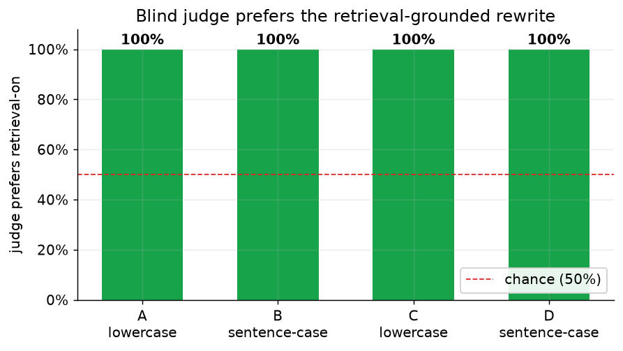

# Does HumanifyMe actually work?

This page is for skeptics. It shows the method, the raw numbers from a real run, and exactly where each number comes from so you can check it yourself. Where the data does not support a claim, we say so.

Run date: 2026-06-24. Four writers, five drafts each, retrieval on and off, plus a blind judge. That is 20 rewrite pairs and 20 judged pairs.

## The method

We test one thing: does retrieving a writer's own past samples make a rewrite sound more like that writer?

The setup:

1. Four writers of distinct register. A is casual and all lowercase. B is formal and sentence case. C is terse and technical, also lowercase. D is warm and enthusiastic, sentence case. They are deliberately spread out so voice differences are measurable.
2. The same generic AI drafts. Every writer gets rewrites of the exact same bland, AI-sounding source drafts. Nothing about a source draft favors one writer.
3. Retrieval ON vs OFF. We run each rewrite twice. ON: the engine retrieves the writer's own past samples and conditions on them. OFF: no retrieval, everything else identical. That is the only variable that changes.
4. Deterministic scoring. Each output is scored on three axes that do not call a model:
   - Stylometric distance: how far the output sits from the writer's real samples in feature space. Lower is closer. See `evals/scorers/stylometry.ts`.
   - Casing fidelity: does the output match the writer's register (0 = all lowercase, 1 = sentence case). See `evals/scorers/casing.ts`.
   - AI-smell: count of generic-AI tells in the output. Lower is better. See `evals/scorers/aiSmell.ts`.
5. A blind LLM judge. A separate judge model is shown the ON output and the OFF output and asked one question: "which sounds more like this person?" We run each pair both ways so position bias cancels out. The judge does not know which output used retrieval.

The script that runs all of this is `evals/harness/runAblation.ts`. The scorers are in `evals/scorers/`. That script makes real Anthropic API calls, so exact numbers move a little between runs.

## What the numbers say

### Register adapts to the writer

Every writer gets register right. The two lowercase writers (A, C) land at 0.00. The two sentence-case writers (B, D) land at 1.00.

Read this honestly: register fidelity is enforced by the deterministic verify gate plus the learned per-writer register, not by retrieval. Retrieval on and retrieval off both hit the target. So this figure proves the product adapts register to whoever the user is. It does not prove retrieval is what does the adapting, and we do not claim it does.

### Rewrites land on the right author

Harder question: take each retrieval-grounded rewrite and ask which of the four writers' real voices it is stylometrically closest to. A correct rewrite lands closest to its own writer.

17 of 20 rewrites (85 percent) classify back to the correct author. The misses are honest and tell you the metric is real: two of writer C's rewrites land closer to writer A, and one of D's lands closer to A. A and C are both casual lowercase voices, so some blur between them is expected. This is not a rigged perfect diagonal.

### Where retrieval helps: stylometric distance

Retrieval pulls the rewrite closer to the real writer for three of the four writers this run:

| Writer | Distance ON | Distance OFF | Retrieval helps? |
| --- | --- | --- | --- |
| A (casual / lowercase) | 2.35 | 3.38 | yes, clearly |
| B (formal / sentence-case) | 3.22 | 2.32 | no, worse this run |
| C (terse / technical) | 2.92 | 3.09 | yes, small |
| D (warm / enthusiastic) | 2.47 | 2.69 | yes, small |

We report writer B even though retrieval hurt the distance score there this run. The metric is noisy and we are not rounding a loss into a win.

### The blind judge

With position bias cancelled, the blind judge preferred the retrieval-grounded output for all four writers this run, 100 percent of judged pairs. Two earlier runs (an older two-writer setup) also came in at 100 percent.

So the deterministic distance metric is mixed for one writer, but the blind judge, asked which output sounds more like the real person, picks the retrieval-grounded one every time here.

### What we are NOT claiming

- We are not claiming retrieval improves casing. The verify gate and learned register do that.
- We are not claiming retrieval lowers stylometric distance for every writer. It did not for writer B this run.
- We are not claiming a single fixed win rate. This run's judge preference was 100 percent; we keep reporting every run, not the best one.

What we are claiming: across four registers, retrieval-grounded rewrites classify back to the correct author 85 percent of the time, pull closer to the real voice on distance for most writers, and win a blind "sounds like this person" judgment.

## Privacy proof: redaction

Before any text leaves your machine, the redactor strips secrets. This is deterministic, not a model, so it gives the same answer every time. From the golden test set in `src/privacy/redact.test.ts`:

- 7 classes of secret tested (emails, phones, addresses, cards, API keys, AWS keys, JWTs).
- 100 percent recall: every planted secret was caught.
- 0 false positives across 20 plain paragraphs: no ordinary text was wrongly redacted.

## Reproduce it yourself

- Raw data: `evals/results/ablation-data.json`.
- Figures: regenerated by `evals/notebooks/proof.ipynb` from that JSON. Run the notebook and the PNGs in `figures/` rebuild.
- Full run: `evals/harness/runAblation.ts` drives the ablation. It makes real Anthropic calls, so your numbers will land near these but not exactly on them.

Each judged number above is 5 pairs per writer (20 pairs total). Still a small sample. We are growing the writer set and the per-writer pair count, and we will update this page when we do.
